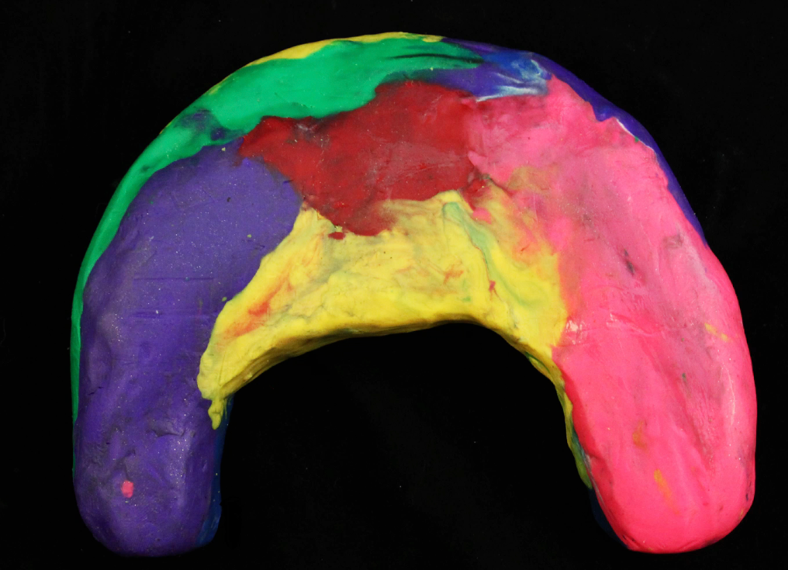
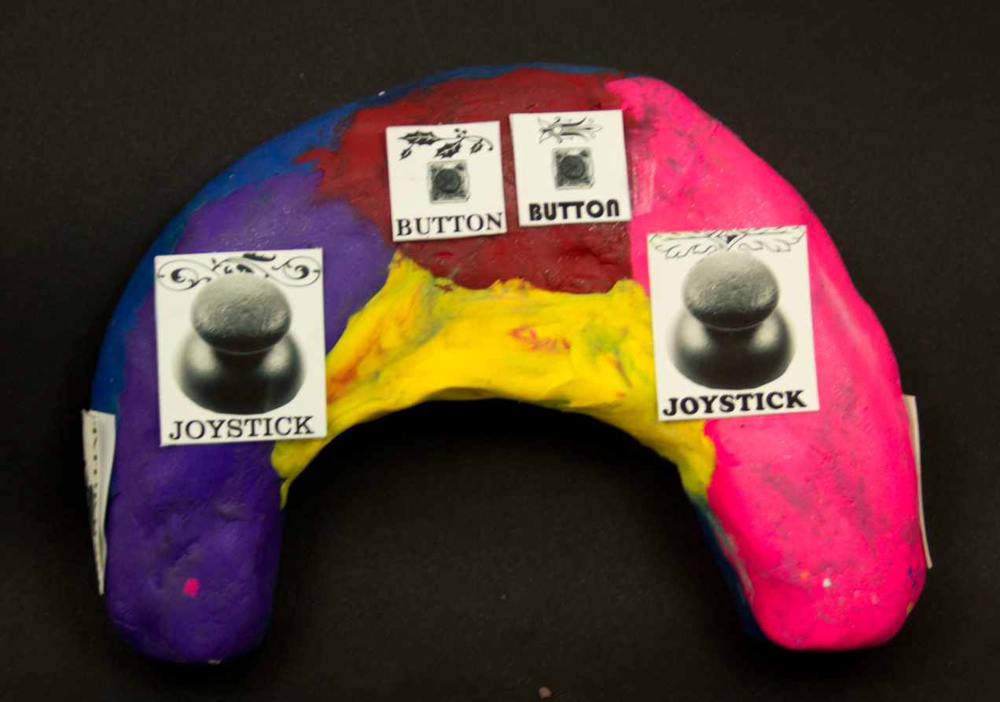
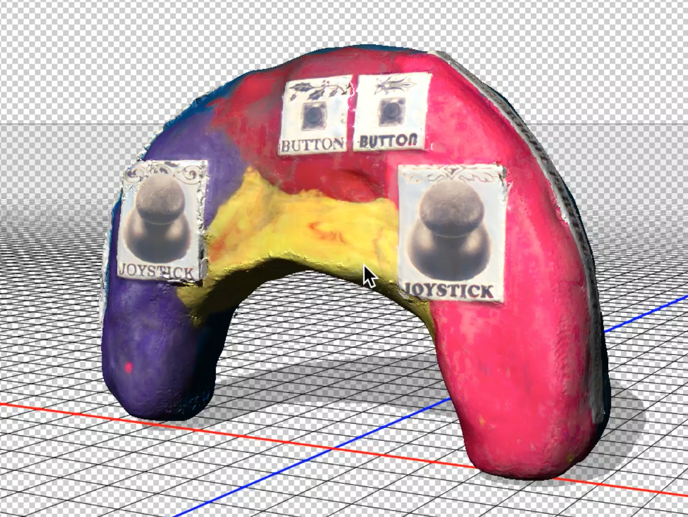
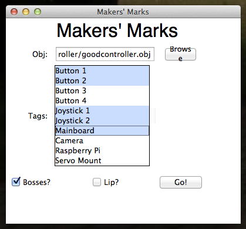
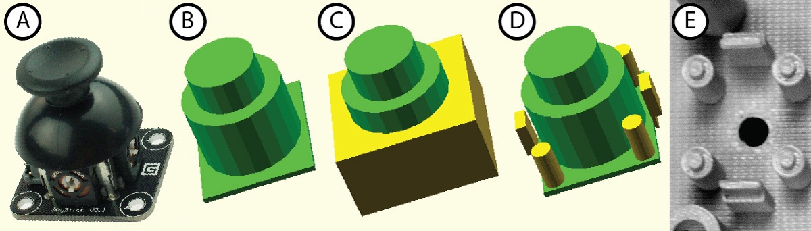

Makers' Marks
=============
Makers' Marks is a toolkit for creating functional objects, like video game
controllers or boxes for keeping secrets. It allows you to use your hands
as your design tool: no need for clunky CAD tools! Simply create an object
that you want to add functionality to out of clay, paper, or whatever you
have on hand :

Then, print out stickers for the functionality you want. This prototype
supports buttons, joysticks, cameras, raspberry pis, servos, LEDs, screens,
gyroscopes, speakers, processing boards, distance sensors, parting lines,
knobs, hinges, and holes. Once you've printed your stickers, just stick
them on where you want them:

Now, 3D scan your object. We tested with a
[NextEngine](www.nextengine.com/ "NextEngine 3D Scanner")
scanner, but in theory you can use
[123DCatch](www.123dapp.com/catch "123D Catch by Autodesk") or
[Matter and Form](https://matterandform.net/scanner "Matter and Form Scanner");
as long as you get an *OBJ file with color* out of it, it's not a big
deal. Put the .jpgs and .mtl file and everything together in the
objs/ folder of the main directory here.

Now boot up the software. Just run "gui.py". Select the tags you used in
your design (narrowing it down speeds up processing) and browse to find the OBJ
of your object.

Hit go, and off you go! Though it will take a long time to process, eventually
the program will spit out an STL or two for you to print.

Preparing to Run Makers' Marks
------------------------------
Maker's Marks relies mainly on openSCAD, C++, python, and Matlab.

To run Makers' Marks, you'll need some extra software that doesn't come
standard:

    sudo pip install enum34

And you'll want to compile our C++ code:

    g++ -std=c++11 -o triCheck triCheck.cpp

You'll also need to download [VLFeat](http://vlfeat.org/install-matlab.html "VLFeat for Matlab")
and add a file to this directory called startup.m containing the line

    run('/path/to/vlfeat-x.y.zz/toolbox/vl_setup')

Finally, you'll have to muck around in config.py to set up your correct Matlab
and openSCAD locations.

Adding New Components to Makers' Marks
--------------------------------------

Each component in Makers' Marks has several parts associated with it: a physical
part, a tag image, and three kinds of geometry. We need subtractive, clearance,
and additive geometry to perform our calculations.

Once you have the geometries, you'll have to make a few code modifications. The
new component needs to be added to component.py , with a link between the name
of the tag image and the name of the component geometry files.

You can also special-case some things for each tag, like the button caps that
we generate in openSCAD.py, but this means you'll probably have to read all
the code first.

### Physical Part

The physical part of the component can be whatever you wish, but make sure it's
got some good attachment points! In our current library, we use a lot of
[.NET Gadgeteer](http://www.netmf.com/gadgeteer/) components because they have
very standardized mounting holes. Your mileage may vary.

### Tag Image

The tag image should be a .jpg stored in the /alltags folder. Note that these
images must be in RGB color space rather than CMYK. Also, since these are going
to be read by a computer, they need some distinctive marks. Right now our
tags incorporate different fonts and vector images from
[a free online repository](http://www.vectorian.net/free-vintage-vectors.html),
but you can draw your own. Photos also work well in tags as long as they have
reasonable contrast.

Also, note that if you want to put more than one of an object in your design
(like putting two buttons), you will need two *different* tags so as not
to confuse our image parser.

### Geometry

All geometry should be in STL format at the proper size (in mm), and kept
in the stls folder following the naming scheme there (-add, -sub, -clearance).

#### Additive Geometry

The additive geometry is what we'll add to the model at the end. For our
electronic components, it usually includes standoffs and clips that they
can snap into. For the hinge, it includes spaces to capture hex nuts for
inserting machine screws.

#### Subtractive Geometry

The subtractive geometry will be subtracted from the model at the end.
This generally includes the geometry of the component itself, as well
as additional access geometry: for example, the joystick needs extra 
space beyond what it usually takes up in order to move around.

#### Clearance Geometry

This is what we'll use to test if components fit in your design. It
should be at least as big as the subtractive geometry, but may also
include some space for electrical connectors (for electronics) or
other necessary space. Our hinge's clearance geometry also includes
space behind it for the hinged parts to open.
